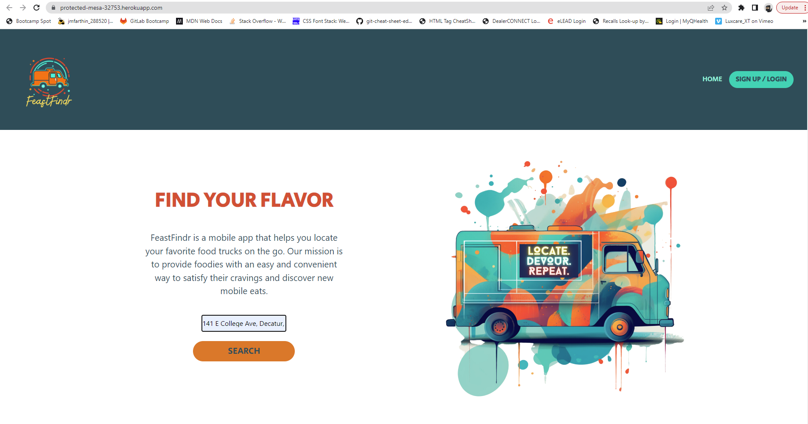
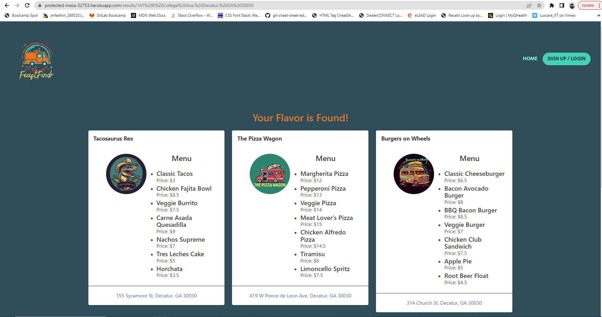
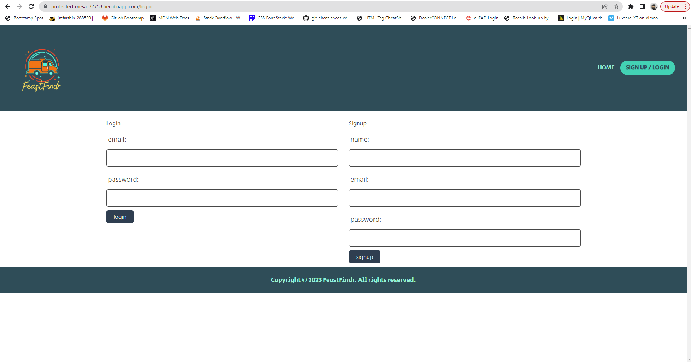
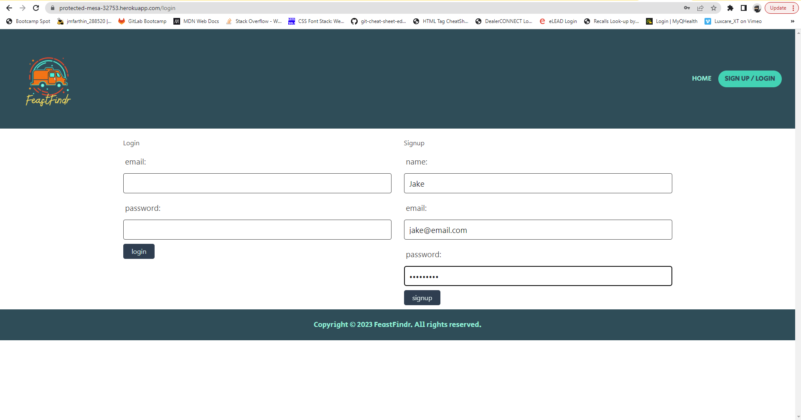
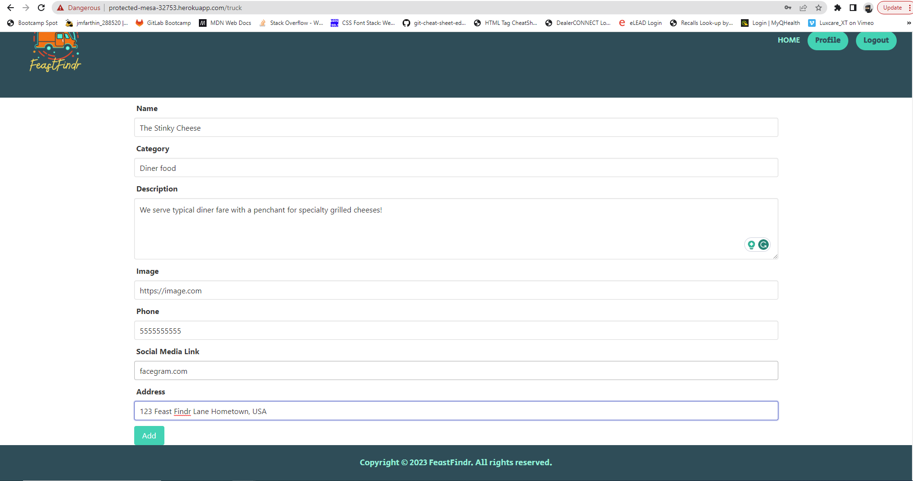
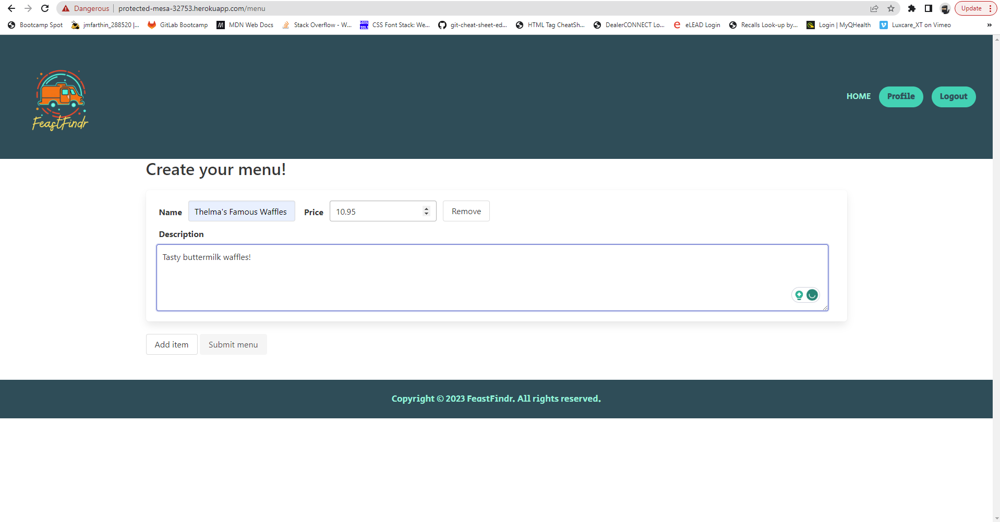
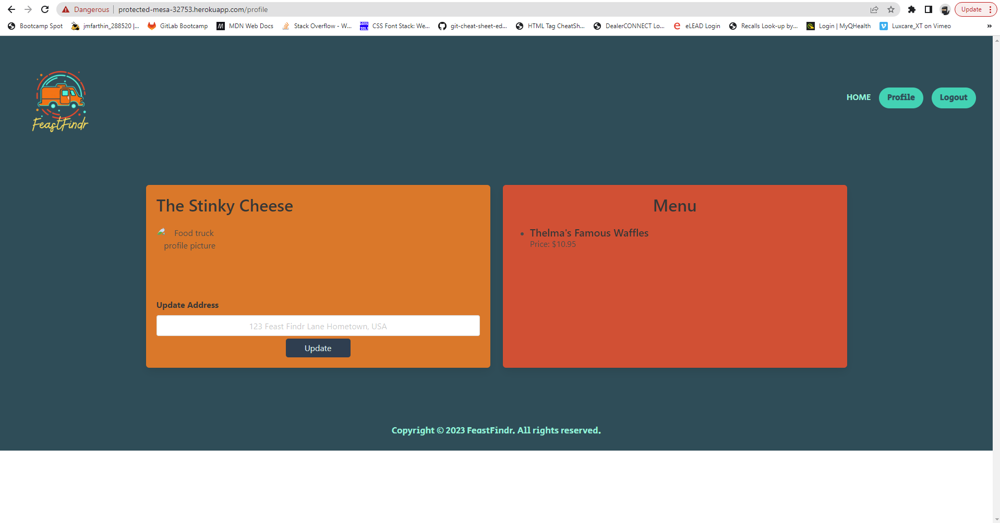

# Feast-Findr

## Description

We've never heard of anybody who doesn't like a good food truck. Whether they are just down the road during your lunchbreak, in the parking lot of the club you just left, or vendors at the hottest music festival, food trucks are a fun and convenient way to try cool new culinary experiences on the go.

The downside of that convenience and mobility is that they can be VERY unpredictable.
They can role into town, serve you a Doner Kebab that can change your life, and drive off the same day!
Feast-Findr connects hungry customers with all the great food trucks in your area! 
Normally finding these trucks is left to chance, with Feast-Finder you know what's nearby whenever the mood strikes!

Making this app taught us how complex the most simple app features can be to design, as well as how rewarding it is to make something that we
would definitely use ourselves!

## Table of Contents (Optional)

If your README is long, add a table of contents to make it easy for users to find what they need.

- [Usage](#usage)
- [Credits](#credits)
- [License](#license)
- [Features](#features)
- [How To Contribute](#how-to-contribute)
- [Tests](#tests)

## Usage

To use Feast-Findr, navigate to https://protected-mesa-32753.herokuapp.com/. Use the address search to find food trucks close to you. If you are a food truck owner, click the sign up/login button to create an account to showcase your food truck and menu.

## Credits

This project was built by: 

Justin Farthing https://github.com/jmfarthin
 
Reggie Mosley   https://github.com/RMosley912
 
Nnamdi Onyeije  https://github.com/nnamdionyeije
 
Derek Sutton    https://github.com/dereksutton
 
Wyatt Otto      https://github.com/wyattotto
 

Credit to Unsplash   (https://unsplash.com/) for photos featured in the app.
 
Credit to Midjourney (https://www.midjourney.com/home/?callbackUrl=%2Fapp%2F) for Truck logo designs.

## License

The MIT License (MIT
)
Copyright (c) 2023 Justin Farthing, Reggie Mosley, Nnamdi Onyeije, Derek Sutton & Wyatt Otto

Permission is hereby granted, free of charge, to any person obtaining a copy of this software and associated documentation files (the "Software"), to deal in the Software without restriction, including without limitation the rights to use, copy, modify, merge, publish, distribute, sublicense, and/or sell copies of the Software, and to permit persons to whom the Software is furnished to do so, subject to the following conditions:

The above copyright notice and this permission notice shall be included in all copies or substantial portions of the Software.

THE SOFTWARE IS PROVIDED "AS IS", WITHOUT WARRANTY OF ANY KIND, EXPRESS OR IMPLIED, INCLUDING BUT NOT LIMITED TO THE WARRANTIES OF MERCHANTABILITY, FITNESS FOR A PARTICULAR PURPOSE AND NONINFRINGEMENT. IN NO EVENT SHALL THE AUTHORS OR COPYRIGHT HOLDERS BE LIABLE FOR ANY CLAIM, DAMAGES OR OTHER LIABILITY, WHETHER IN AN ACTION OF CONTRACT, TORT OR OTHERWISE, ARISING FROM, OUT OF OR IN CONNECTION WITH THE SOFTWARE OR THE USE OR OTHER DEALINGS IN THE SOFTWARE.

---

## Features

This app serves two clients : 1. Adventurous diners 2. The food trucks that serve them.

For the diners, they can hop on Feast-Findr, put in their address, and receive a list of food trucks within a 25 mile radius.
They can then select and view info on the food trucks.

For the food truck owners, they can create a profile and add their food truck. The truck's name, type of cuisine, logo, menu 
and location are all displayed to the user when selected. 

## How to Contribute

 Any contributions you make are greatly appreciated by the team.

If you have a suggestion that would imrpove the app's functionality, feel free to fork the repo and create a pull request. 

You can also open an issue on the main branch. Please be as descriptive as possible as for the idea/issue and any potential solution.

Fork the Project
 
Create your Feature Branch (ex. git checkout -b feature/MyNewFeature)
 
Commit your Changes (git commit -m 'Added MyNewFeature')
 
Push to the Branch (git push origin feature/MyNewFeature)
 
Open a Pull Request

## Tests

Try out different addresses in the search bar! We want to serve hungry people all over the country let us know if there are any areas with food trucks that don't work with FeastFindr!
